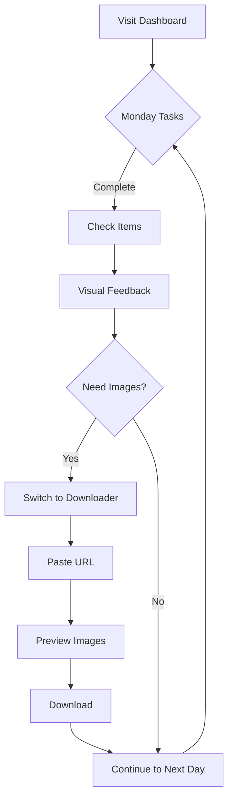

# ToonMaker Studio - Design Brief for AI Generation

## Project Vision
**ToonMaker Studio** is a productivity web application designed for content creators who produce Naver Webtoon video content. The tool helps busy creators (especially those balancing childcare) efficiently manage their 5-day production routine and collect webtoon images for content creation.

## Target Users
- **Primary**: Individual content creators making Naver Webtoon commentary/review videos
- **Profile**: Busy parents managing content creation alongside childcare
- **Tech Savvy**: Comfortable with web tools, seeking automation and efficiency
- **Content Schedule**: Produces content on a strict Monday-Friday schedule

## Design Objectives
Create a clean, efficient, and motivating dashboard that:
1. **Reduces cognitive load** - Clear visual hierarchy with minimal distractions
2. **Encourages daily progress** - Visual feedback and completion tracking
3. **Streamlines workflow** - Quick access to frequently used tools
4. **Feels professional yet friendly** - Balances productivity with warmth

## Design Style & Aesthetics

### Visual Tone
- **Modern and minimal** - Clean lines, ample whitespace
- **Productivity-focused** - Professional but not corporate
- **Encouraging** - Positive, motivating atmosphere
- **Efficient** - Information-dense without feeling cluttered

### Color Palette Suggestions
- **Primary**: Deep blue or teal (trust, productivity, calm)
- **Accent**: Vibrant green or orange (progress, energy, completion)
- **Neutrals**: Light grays and whites (clean background)
- **Alerts**: Soft yellow/amber for pending tasks

### Typography
- **Headlines**: Bold, clear sans-serif (e.g., Inter, Poppins)
- **Body**: Readable sans-serif with good line height
- **Emphasis**: Use of weight and color for hierarchy

## Key Screens & Components

### 1. Main Dashboard (Landing Page)
**Layout**: Single-page application with two main sections side-by-side

**Left Section: Weekly Routine Checklist**
- **Header**: "5-Day Production Routine" with week progress indicator
- **Daily Cards**: 5 expandable cards (Monday-Friday), each containing:
  - Day label and emoji/icon
  - Task title (e.g., "Monday: Script Planning")
  - Checklist items for that day
  - Visual progress indicator (percentage or progress bar)
  - Completion status (checked/unchecked items)
  
**Visual Hierarchy**:
- Current day highlighted with accent color
- Completed days show checkmark badge
- Future days appear slightly dimmed
- Each day uses distinct but harmonious colors

**Right Section: Webtoon Downloader**
- **Header**: "Weekly Webtoon Organizer"
- **Tab Navigation**: Monday through Friday tabs
- **Input Area** per tab:
  - URL input field with placeholder "Paste Naver Webtoon URL..."
  - "Analyze" button
  - Preview card showing:
    - Thumbnail image
    - Webtoon title
    - Episode number and name
    - Image count indicator
  - "Download" button (prominent when ready)
- **Bulk Action**: "Download All Week" button at bottom

### 2. Component Details

#### Checklist Items
```
Visual Design:
- Checkbox (custom styled, not default browser)
- Task text (clear, readable)
- Hover state (subtle background highlight)
- Completed state (strikethrough + checkmark)
- Smooth animation on check/uncheck
```

#### Webtoon Preview Card
```
Layout:
┌─────────────────────────────┐
│  [Thumbnail]  │  Title      │
│   Image       │  Episode #  │
│  (120x80)     │  "Episode"  │
│               │  📷 45 imgs │
└─────────────────────────────┘
```

#### Progress Indicators
- **Weekly Progress**: Horizontal bar showing week completion (0-100%)
- **Daily Progress**: Circular progress ring or mini bar per day
- **Overall Stats**: Small card showing "3/5 days completed" with visual

### 3. User Flow



## UI Features & Interactions

### Micro-interactions
1. **Checkbox Animation**: Smooth scale and color transition when checked
2. **Progress Updates**: Animated progress bar fill
3. **Day Card Expansion**: Accordion-style expand/collapse
4. **Download Status**: Loading spinner → Success checkmark
5. **Toast Notifications**: Success/error messages for downloads

### Responsive Behavior
- **Desktop** (1024px+): Side-by-side layout
- **Tablet** (768px-1023px): Stacked sections with sticky navigation
- **Mobile** (< 768px): Single column, tab-based navigation between sections

### Accessibility
- High contrast ratios (WCAG AA minimum)
- Keyboard navigation support
- Clear focus states
- Screen reader friendly labels

## Visual Examples to Reference

### Style Inspiration
- **Notion**: Clean, minimal, efficient task management
- **Todoist**: Clear daily task visualization
- **Linear**: Modern, professional productivity tool
- **Calm**: Soothing colors, stress-free design

### Layout Reference
```
┌────────────────────────────────────────────────────┐
│  ToonMaker Studio              [Settings] [Help]   │
├──────────────────┬─────────────────────────────────┤
│  5-Day Routine   │  Webtoon Downloader             │
│                  │  [ Mon | Tue | Wed | Thu | Fri ]│
│  Week Progress   │                                  │
│  ▓▓▓▓▓▓▒▒▒▒ 60%  │  📎 Paste URL                   │
│                  │  ┌──────────────────────────┐   │
│  🟢 Mon          │  │                          │   │
│  ✅ [x] Task 1   │  │   [ Webtoon Preview ]    │   │
│  ✅ [x] Task 2   │  │                          │   │
│                  │  └──────────────────────────┘   │
│  🟡 Tue          │                                  │
│  ☐ [ ] Task 1    │  [    Download Images     ]     │
│  ☐ [ ] Task 2    │                                  │
│                  │                                  │
│  ⚪ Wed          │  ──────────────────────────────  │
│  ...             │  [  Download All Week  ]         │
└──────────────────┴─────────────────────────────────┘
```

## Technical Constraints
- **Framework**: Next.js (React)
- **Styling**: Tailwind CSS v4
- **No Login**: Single-user, localStorage-based
- **Browser**: Modern browsers (Chrome, Safari, Firefox)

## Success Metrics (Design Goals)
1. User can complete weekly checklist setup in < 2 minutes
2. Download workflow takes < 30 seconds per webtoon
3. Interface feels calm and organized, not overwhelming
4. Progress is immediately visible and motivating
5. Mobile experience is just as efficient as desktop

## Deliverables Requested from AI
1. **Main Dashboard UI Design** - Complete layout with both sections
2. **Component Variations** - Different states (empty, loading, completed)
3. **Color Palette** - Specific hex codes for primary, accent, neutral colors
4. **Mobile Layout** - Responsive design for < 768px screens
5. **Interactive States** - Hover, active, disabled, success states

## Additional Context
This is a personal productivity tool, not a commercial product. The design should feel helpful and supportive, like a personal assistant for content creation. Avoid corporate or enterprise aesthetics—think indie app with careful attention to detail.

---

**Priority**: Clean, efficient, motivating experience that makes content creation feel manageable and organized.
